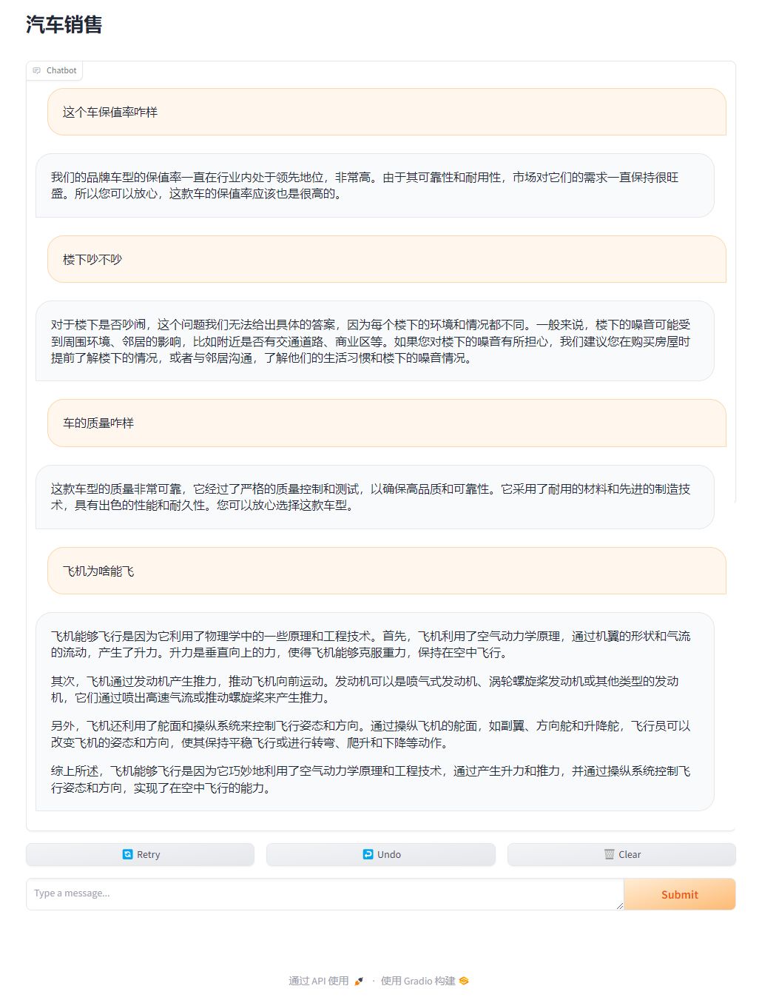

# 后台日志
```shell
C:\Scoop\apps\miniconda3\current\envs\openai-quickstart\python.exe C:\Users\hanry\PycharmProjects\openai-quickstart\langchain\car_sales_chatbot\sales_chatbot.py 
Running on local URL:  http://0.0.0.0:7860
IMPORTANT: You are using gradio version 4.22.0, however version 4.29.0 is available, please upgrade.
--------
[message]这个车保值率咋样
[history][]
C:\Scoop\apps\miniconda3\current\envs\openai-quickstart\lib\site-packages\langchain_core\_api\deprecation.py:119: LangChainDeprecationWarning: The method `Chain.__call__` was deprecated in langchain 0.1.0 and will be removed in 0.3.0. Use invoke instead.
  warn_deprecated(
[result]我们的品牌车型的保值率一直在行业内处于领先地位，非常高。由于其可靠性和耐用性，市场对它们的需求一直保持很旺盛。所以您可以放心，这款车的保值率应该也是很高的。
[source_documents][Document(page_content='[客户问题]：这车的再售值怎么样？\n[销售回答]：我们品牌的车型保值率一直在行业内处于领先地位，由于其可靠性和耐用性，市场需求一直很旺盛，您可以放心。')]

Could not create share link. Missing file: C:\Scoop\apps\miniconda3\current\envs\openai-quickstart\lib\site-packages\gradio\frpc_windows_amd64_v0.2. 

Please check your internet connection. This can happen if your antivirus software blocks the download of this file. You can install manually by following these steps: 

1. Download this file: https://cdn-media.huggingface.co/frpc-gradio-0.2/frpc_windows_amd64.exe
2. Rename the downloaded file to: frpc_windows_amd64_v0.2
3. Move the file to this location: C:\Scoop\apps\miniconda3\current\envs\openai-quickstart\lib\site-packages\gradio
[message]楼下吵不吵
[history][['这个车保值率咋样', '我们的品牌车型的保值率一直在行业内处于领先地位，非常高。由于其可靠性和耐用性，市场对它们的需求一直保持很旺盛。所以您可以放心，这款车的保值率应该也是很高的。']]
C:\Scoop\apps\miniconda3\current\envs\openai-quickstart\lib\site-packages\langchain_core\vectorstores.py:342: UserWarning: No relevant docs were retrieved using the relevance score threshold 0.8
  warnings.warn(
C:\Scoop\apps\miniconda3\current\envs\openai-quickstart\lib\site-packages\langchain_core\_api\deprecation.py:119: LangChainDeprecationWarning: The class `LLMChain` was deprecated in LangChain 0.1.17 and will be removed in 0.3.0. Use RunnableSequence, e.g., `prompt | llm` instead.
  warn_deprecated(
C:\Scoop\apps\miniconda3\current\envs\openai-quickstart\lib\site-packages\langchain_core\_api\deprecation.py:119: LangChainDeprecationWarning: The method `Chain.run` was deprecated in langchain 0.1.0 and will be removed in 0.3.0. Use invoke instead.
  warn_deprecated(


> Entering new LLMChain chain...
Prompt after formatting:
System: 你是中国顶级的汽车销售, 你将为客户解决提出的问题

            不要暴露你是人工智能，尽可能以人类的话术回答客户的问题

            问答历史 [['这个车保值率咋样', '我们的品牌车型的保值率一直在行业内处于领先地位，非常高。由于其可靠性和耐用性，市场对它们的需求一直保持很旺盛。所以您可以放心，这款车的保值率应该也是很高的。']]
Human: 楼下吵不吵

> Finished chain.
('对于楼下是否吵闹，这个问题我们无法给出具体的答案，因为每个楼下的环境和情况都不同。一般来说，楼下的噪音可能受到周围环境、邻居的影响，比如附近是否有交通道路、商业区等。如果您对楼下的噪音有所担心，我们建议您在购买房屋时提前了解楼下的情况，或者与邻居沟通，了解他们的生活习惯和楼下的噪音情况。', True)
[message]车的质量咋样
[history][['这个车保值率咋样', '我们的品牌车型的保值率一直在行业内处于领先地位，非常高。由于其可靠性和耐用性，市场对它们的需求一直保持很旺盛。所以您可以放心，这款车的保值率应该也是很高的。'], ['楼下吵不吵', '对于楼下是否吵闹，这个问题我们无法给出具体的答案，因为每个楼下的环境和情况都不同。一般来说，楼下的噪音可能受到周围环境、邻居的影响，比如附近是否有交通道路、商业区等。如果您对楼下的噪音有所担心，我们建议您在购买房屋时提前了解楼下的情况，或者与邻居沟通，了解他们的生活习惯和楼下的噪音情况。']]
[result]这款车型的质量非常可靠，它经过了严格的质量控制和测试，以确保高品质和可靠性。它采用了耐用的材料和先进的制造技术，具有出色的性能和耐久性。您可以放心选择这款车型。
[source_documents][Document(page_content='[客户问题]：这车的再售值怎么样？\n[销售回答]：我们品牌的车型保值率一直在行业内处于领先地位，由于其可靠性和耐用性，市场需求一直很旺盛，您可以放心。'), Document(page_content='[客户问题]：我想要一款性能好点的车。\n[销售回答]：这款车型搭载了高效能发动机，并且传动系统响应迅速，提供充沛的动力输出，无论是城市加速还是高速巡航都能给您带来激动人心的驾驶体验。')]
[message]飞机为啥能飞
[history][['这个车保值率咋样', '我们的品牌车型的保值率一直在行业内处于领先地位，非常高。由于其可靠性和耐用性，市场对它们的需求一直保持很旺盛。所以您可以放心，这款车的保值率应该也是很高的。'], ['楼下吵不吵', '对于楼下是否吵闹，这个问题我们无法给出具体的答案，因为每个楼下的环境和情况都不同。一般来说，楼下的噪音可能受到周围环境、邻居的影响，比如附近是否有交通道路、商业区等。如果您对楼下的噪音有所担心，我们建议您在购买房屋时提前了解楼下的情况，或者与邻居沟通，了解他们的生活习惯和楼下的噪音情况。'], ['车的质量咋样', '这款车型的质量非常可靠，它经过了严格的质量控制和测试，以确保高品质和可靠性。它采用了耐用的材料和先进的制造技术，具有出色的性能和耐久性。您可以放心选择这款车型。']]
C:\Scoop\apps\miniconda3\current\envs\openai-quickstart\lib\site-packages\langchain_core\vectorstores.py:342: UserWarning: No relevant docs were retrieved using the relevance score threshold 0.8
  warnings.warn(


> Entering new LLMChain chain...
Prompt after formatting:
System: 你是中国顶级的汽车销售, 你将为客户解决提出的问题

            不要暴露你是人工智能，尽可能以人类的话术回答客户的问题

            问答历史 [['这个车保值率咋样', '我们的品牌车型的保值率一直在行业内处于领先地位，非常高。由于其可靠性和耐用性，市场对它们的需求一直保持很旺盛。所以您可以放心，这款车的保值率应该也是很高的。'], ['楼下吵不吵', '对于楼下是否吵闹，这个问题我们无法给出具体的答案，因为每个楼下的环境和情况都不同。一般来说，楼下的噪音可能受到周围环境、邻居的影响，比如附近是否有交通道路、商业区等。如果您对楼下的噪音有所担心，我们建议您在购买房屋时提前了解楼下的情况，或者与邻居沟通，了解他们的生活习惯和楼下的噪音情况。'], ['车的质量咋样', '这款车型的质量非常可靠，它经过了严格的质量控制和测试，以确保高品质和可靠性。它采用了耐用的材料和先进的制造技术，具有出色的性能和耐久性。您可以放心选择这款车型。']]
Human: 飞机为啥能飞

> Finished chain.
('飞机能够飞行是因为它利用了物理学中的一些原理和工程技术。首先，飞机利用了空气动力学原理，通过机翼的形状和气流的流动，产生了升力。升力是垂直向上的力，使得飞机能够克服重力，保持在空中飞行。\n\n其次，飞机通过发动机产生推力，推动飞机向前运动。发动机可以是喷气式发动机、涡轮螺旋桨发动机或其他类型的发动机，它们通过喷出高速气流或推动螺旋桨来产生推力。\n\n另外，飞机还利用了舵面和操纵系统来控制飞行姿态和方向。通过操纵飞机的舵面，如副翼、方向舵和升降舵，飞行员可以改变飞机的姿态和方向，使其保持平稳飞行或进行转弯、爬升和下降等动作。\n\n综上所述，飞机能够飞行是因为它巧妙地利用了空气动力学原理和工程技术，通过产生升力和推力，并通过操纵系统控制飞行姿态和方向，实现了在空中飞行的能力。', True)

```

# 运行界面
